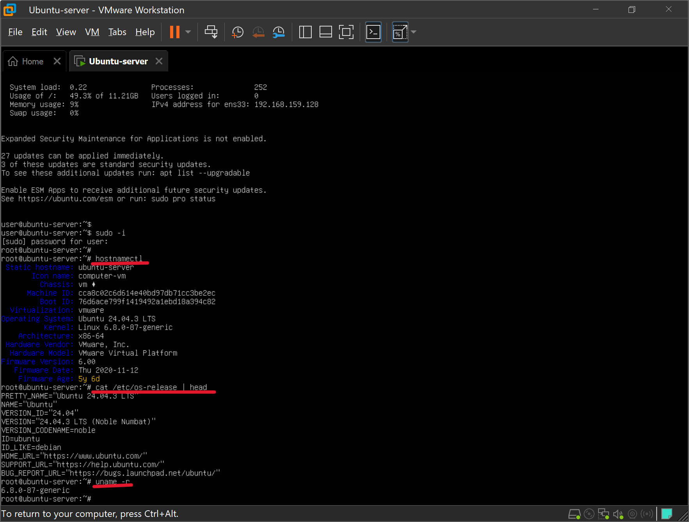
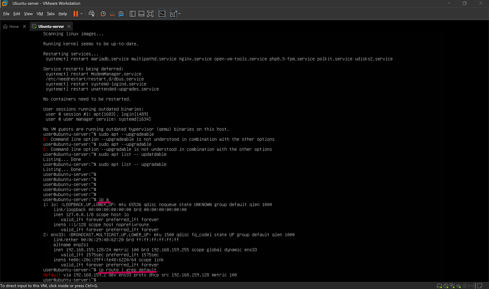
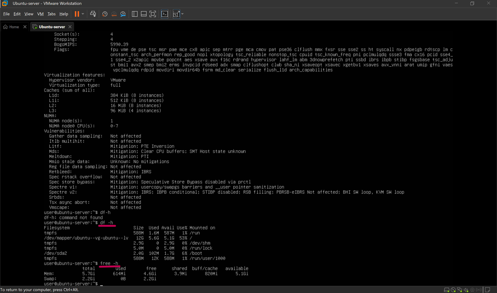
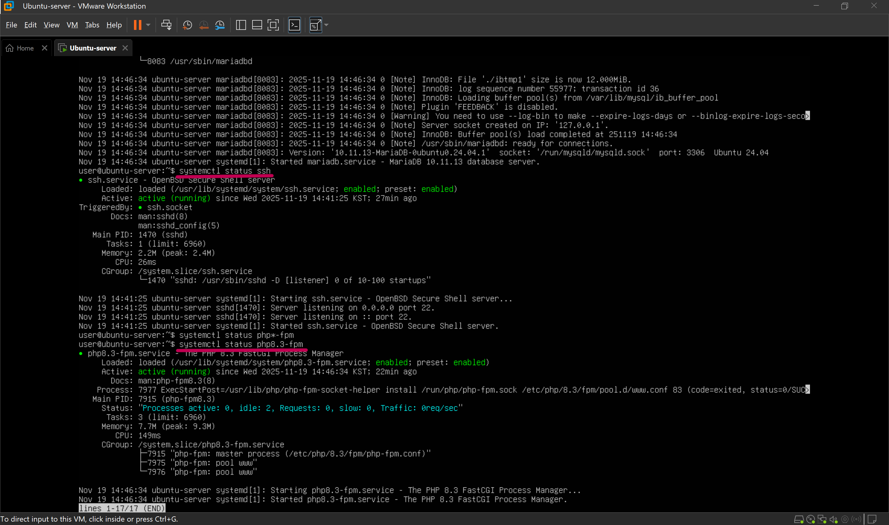
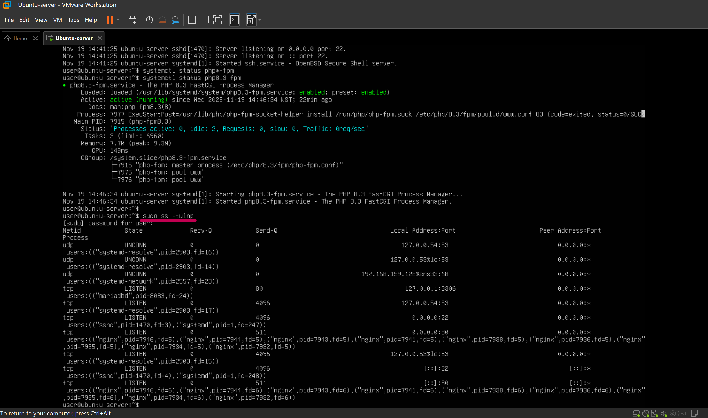
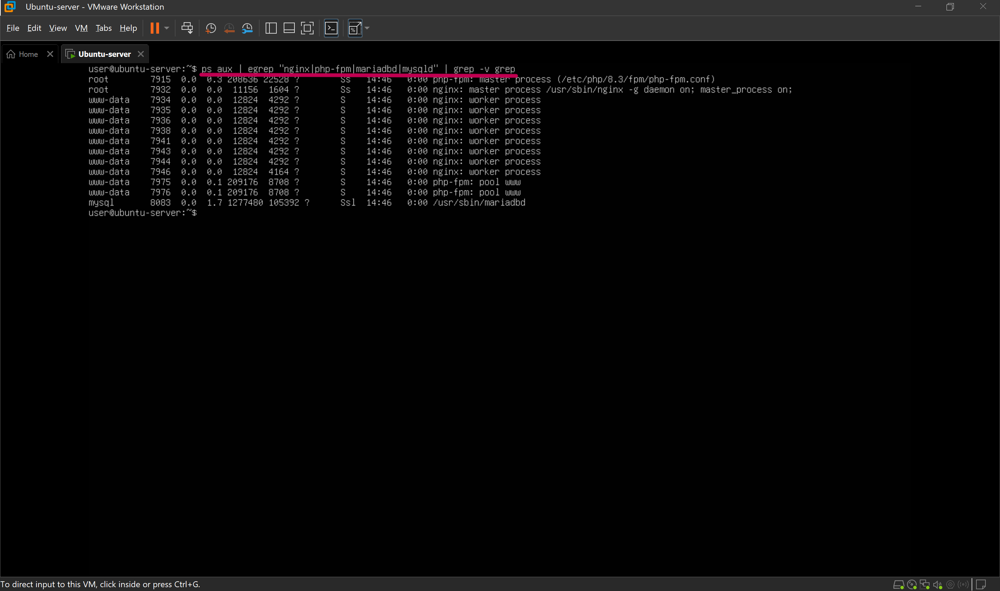

## 서버 인수인계 받기 (현재 상태 확인)
(아래 내용의 코드블럭 안은 Linux 명령어 입니다.)
### 1. 서버의 각종 현재 상태 확인

1) OS/호스트 정보를 확인 합니다.
    ```bash
    hostnamectl
    cat /etc/os-release | head
    uname -r
    ```
    
<br>

2) IP / 네트워크 기본 정보를 확인 합니다.
    ```bash
	ip a
    ip route | grep default
    ```
    
<br>

3) 디스크 / 메모리 / CPU 상태를 확인 합니다.
    ```bash
	df -h
	free -h
    lscpu
    ```
    
<br>

4) 주요 서비스 상태 점검(Nginx / PHP-FPM / Maria DB / SSH)
    ```bash
	systemctl status nginx
	systemctl status mariadb
	systemctl status ssh
    systemctl status php8.3-fpm
    ```
    
<br>

5) 포트 상태 확인
    ```bash
	sudo ss -tultp
    ```
    
<br>

6) 프로세스 트리, 목록 확인
    ```bash
	ps aux | egrep "nginx|php-fpm|mariadbd|mysqld" | grep -v grep
    ```
    
<br>


### 2. 서비스 의존성(아키텍처) 정리
* 본 프로젝트의 웹 서비스 요청 흐름은 다음과 같습니다.
1) 클라이언트는 HTTP(80) 포트로 Nginx에 접속합니다.
2) Nginx는 정적 컨텐츠는 직접 제공하고, PHP 요청은 PHP-FPM으로 전달 합니다.
3) PHP-FPM은 PHP 스크립트를 실행하며, 필요 시 MariaDB(port 3306)로부터 데이터를 조회합니다.
4) 최종 결과는 Nginx를 통해 클라이언트에게 전달 됩니다.
    ```
    [Client Browser]
            |
            v
    [Nginx:80]
            |
       (PHP 요청)
            v
    [PHP-FPM socket/9000]
            |
       (SQL 쿼리)
            v
    [MariaDB:3306]
    ```