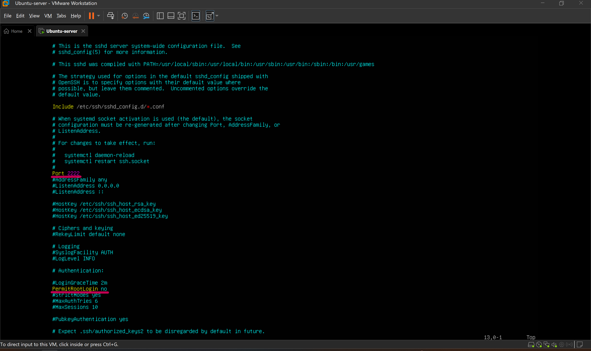

## 서버 보안강화
(아래 내용의 코드블럭 안은 Linux 명령어 or PowerShell 명령어 입니다.)<br>
### 학습 목표: 인수인계 받은 서버의 보안을 강화합니다.
<br>

### 1. SSH보안 강화

1) SSH포트 변경, root 로그인 금지 
- Brute-force 형태의 공격면적을 줄이기 위해 SSH포트변경, root로그인 금지를 설정합니다.
    ```bash
    # vi 편집기로 sshd_config 파일을 열어 Port 변경 22 > 2222
    # root 로그인 금지 PermitRootLogin yes > no
    sudo vi /etc/ssh/sshd_config
    
    # 데몬 리로드, SSH restart 후 상태 확인
    sudo systemctl daemon-reload
    sudo systemctl restart ssh
    sudo systemctl status ssh
    ```
    
    
<br>

2) 비밀번호 로그인 금지
- 비밀번호 로그인 금지를 설정하기 전에 SSH 키 생성과 공개키 서버 업로드를 합니다.
    ```bash
    # MS PowerShell 에서 아래의 명령어로 공개키와 개인키를 생성합니다.
    ssh-kegen -t ed25519
    ```
    <br>
    ```bash
    # MS PowerShell 에서 아래 명령어로 공개키를 열고, 키 안의 문자열 전체를 복사합니다.
    cat $env:USERPROFILE\.ssh\id_ed25519.pub

    # 복사한 문자열을 Linux 서버에서 아래 명령어를 사용해 authorized_keys 생성 시 붙여 넣습니다.
    mkdir -p ~/.ssh
    nano ~/.ssh/authorized_keys

    # 공개키의 권한을 설정합니다.
    chmod 700 ~/.ssh
    chmod 600 ~/.ssh/authorized_keys

    # 키가 준비 됐으니 비밀번호 로그인을 꺼줍니다. PasswordAuthentication yes > no
    sudo vi /etc/ssh/sshd_config
    ```
    : sshd_config 파일은 이번 보안 조치로 최종적으로 아래와 같이 설정 되어야 합니다.
    - Port 2222
    - PermitRootLogin <span style="color:red">no</span>
    - PasswordAuthentication <span style="color:red">no</span>
    - PubkeyAuthentication <span style="color:green">yes</span>
<br><br>

- 최종 결과를 확인 합니다.<br>
    : 기본포트(22)로 접속 실패, root 접속 실패, 포트 2222로 로그인 시 패스워드를 입력하지 않음(개인키로 로그인 했기 때문)
    <br>
<br><br>

### 2. Fail2ban을 이용한 SSH보호, Nginx보호용 커스텀 jail 구성

1) Fail2ban 설치
    ```bash
    sudo apt update
    sudo apt install fail2ban -y
    ```

2) SSH 보호용 jail 설정
    - Fail2ban 설정은 /etc/fail2ban/jail.conf 가 기본값이지만,<br>
    이 기본값 파일은 패키지 업데이트 때 덮어씌워지기 때문에 jail.local을 사용해 커스텀 설정을 해줍니다.
    ```bash
    sudo vi /etc/fail2ban/jail.local
    ```
    ```ini
    # jail.local을 아래와 같이 수정 후 저장 합니다.
    # 아래의 내용은 2222 포트로 10분 안에 4번 실패하면 1시간 동안 차단
    [sshd]
    enabled = true
    port = 2222
    logpath = /var/log/auth.log
    maxretry = 4
    findtime = 600
    bantime = 3600
    ```

3) Nginx 보호용 커스텀 jail 설정
- 404 스캔 공격 방어용 커스텀 jail을 설정합니다.<br>
: 404 스캔 공격이란?<br>
공격자가 서버에 존재하지 않는 URL를 수십,수백번 자동요청하여 취약한 파일과 디렉터리를 찾는 공격입니다.<br>
서버 입장에서는 해당 요청 들이 전부 404 Not Found 로그로 남기 때문에 이를 이용해
악의적인 공격을 파악하고 차단하는 방법입니다.

    ```bash
    # 404 오류 발생을 걸러내기 위한 필터를 작성합니다.
    sudo vi /etc/fail2ban/filter.d/nginx-404.conf
    ```
    ```ini
    # nginx-404.conf를 아래와 같이 작성 후 저장 합니다.
    [Definition]
    failregex = ^<HOST> .* "GET .* HTTP/1\.1" 404 .*$
    ignoreregex =
    ```
    ```ini
    # jail.local에는 아래 내용을 추가합니다.
    [nginx-404]
    enabled  = true
    port     = http,https
    filter   = nginx-404
    logpath  = /var/log/nginx/access.log
    backend = auto
    maxretry = 15
    findtime = 300
    bantime  = 7200
    ```
- 최종 결과를 확인 합니다.<br>
    : SSH 방어 중, Nginx 방어 중 임을 확인합니다.<br>
    <br>
<br><br>
    

4) Fail2ban 실제 공격 로그 보기
- 위에서 설정한 Fail2ban이 실제 동작하는지 테스트 해보겠습니다.<br>
    : 먼저 SSH PASSWORD FAIL 동작 여부를 확인 하겠습니다.
    ```bash
    sudo vi /etc/ssh/sshd_config
    ```
    ```ini
    # 비밀번호를 계속 틀리게 하여 SSH 보호가 잘 작동하는지 확인해야 하기 때문에 sshd_config 파일을 아래와 같이 수정합니다.
    # key 로그인 no, password 로그인 yes
    PubkeyAuthentication no
    PasswordAuthentication yes
    ```
    : 틀린 비밀번호로 계속 로그인을 시도 합니다.<br>
    <br>
    : 필터로 4번 fail을 감지했고 5번째에는 ban이 되어 잘 동작함을 확인 했습니다.<br>
    <br>

    : 이제 Nginx 404 스캔 공격을 해보겠습니다.
    ```powershell
    #MS PowerShell 에서 아래 명령어로 404 공격을 50번 시도합니다.
    for ($i=0; $i -lt 50; $i++) { curl.exe http://192.168.159.128/123123.txt ; }
    ```
    : 공격 중 ban을 당해 서버로부터의 응답이 없는 상태 입니다.<br>
    <br>
    : 19번의 fail이 감지되었고 ban이 되어 404 공격 방어에 성공하였습니다.<br>
    <br>