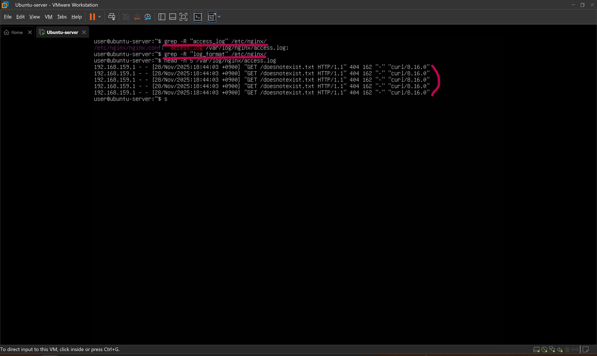

## 로그분석, 장애상황재현, 원인 분석
(아래 내용의 코드블럭 안은 Linux 명령어 or PowerShell 명령어 입니다.)<br>
### 학습 목표: Nginx 웹 서버에 발생한 404 응답 폭주 상황을 가정하여 이에 대응 및 원인 규명의 과정을 시뮬레이션 합니다.

### 장애 발생 시나리오
1. 공격자가 존재하지 않는 경로로 짧은 시간 동안 수십, 수백번 요청을 보내는 404 폭주 상황 발생
2. Nginx access.log 에는 다량의 404 로그가 쌓임
3. Fail2ban을 이용해 404 반복 발생 IP를 자동 차단하려 했으나, 차단 동작이 되지 않는 장애 발생
4. 이 문제를 로그분석 -> 장애 재현 -> 설정/구조 분석 -> 원인 규명 및 수정 순으로 해결


<br>

### 1. 로그 포멧 이해

1) Nginx 커스텀 jail OFF
- 장애 발생 시나리오를 시뮬레이션 하기 위해 지난 2단락에서 만든 Nginx 커스텀 jail을 끄도록 하겠습니다.
    ```bash
    # vi 편집기로 jail.local 파일을 열어 enabled true > false
    sudo vi /etc/fail2ban/jail.local
    sudo systemctl restart fail2ban
    sudo fail2ban-client status nginx-404 #"jail 'nginx-404' does not exist" 확인
    ```
<br>

2) Nginx 로그 구조 이해
- access log 위치를 찾고, log format이 커스텀 되어 있을지 모르니 log format도 찾아봅니다.
    ```bash
    grep -R "access_log" /etc/nginx # access log 위치
    grep -R "log_format" /etc/nginx # log format 형태 조회
    head -n 5 /var/log/nginx/access.log # access log 조회
    ```
    <br>
    : access.log 위치를 찾았고, log format은 따로 커스텀 되어 있지 않음을 확인 했습니다.<br>
    기본 포멧이기 때문에 로그는 아래와 같은 순서로 나타나게 됩니다.<br>
    - 192.168.159.1: 클라이언트 IP<br>
    - [시간]: 요청 시간<br>
    - "GET /doesnotexist.txt": 메서드, URL, 프로토콜<br>
    - 404: HTTP 응답코드<br>
    - 162: 응답 바이트 수<br>
    - "curl/8.16.0": User-Agent(클라이언트의 자기 신분을 알려주는 식별자, curl로 공격했기 때문에 curl로 나오게 됩니다.)<br>
