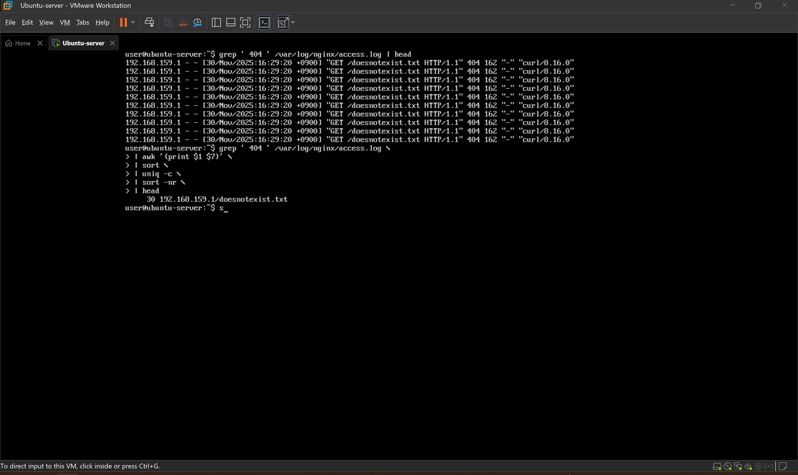
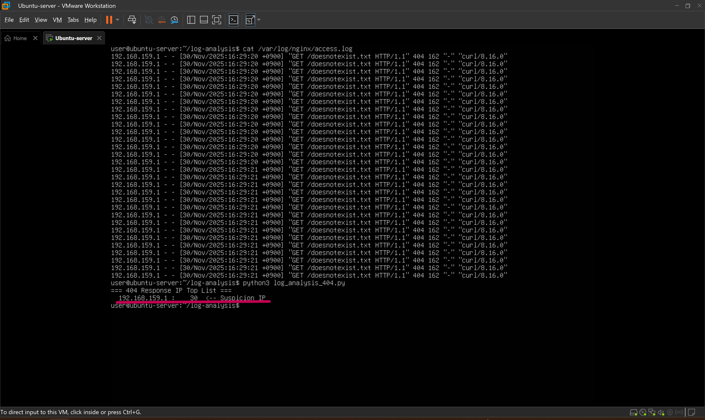
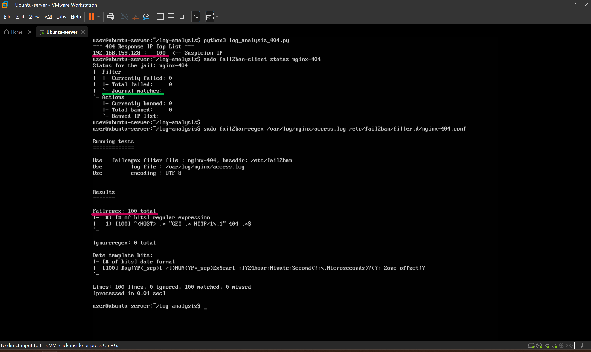
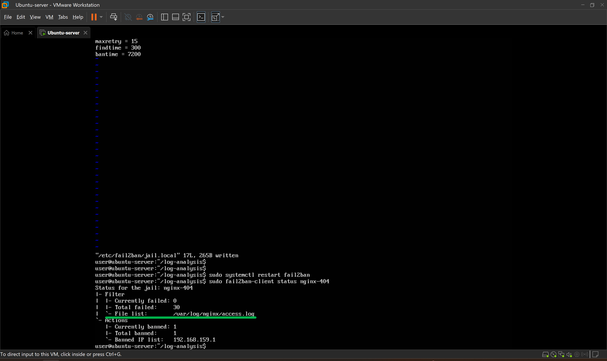

## 로그분석, 장애상황재현, 원인 분석
(아래 내용의 코드블럭 안은 Linux 명령어 or PowerShell 명령어 입니다.)<br>
### 학습 목표: Nginx 웹 서버에 발생한 404 응답 폭주 상황을 가정하여 이에 대응 및 원인 규명의 과정을 시뮬레이션 합니다.

### 장애 발생 시나리오
1. 공격자가 존재하지 않는 경로로 짧은 시간 동안 수십, 수백번 요청을 보내는 404 폭주 상황 발생
2. Nginx access.log 에는 다량의 404 로그가 쌓임
3. Fail2ban을 이용해 404 반복 발생 IP를 자동 차단하려 했으나, 차단 동작이 되지 않는 장애 발생
4. 이 문제를 로그분석 -> 장애 재현 -> 설정/구조 분석 -> 원인 규명 및 수정 순으로 해결


<br>

### 1. 로그 포멧 이해

1) Nginx 로그 구조 이해
- access log 위치를 찾고, log format이 커스텀 되어 있을지 모르니 log format도 찾아봅니다.
    ```bash
    grep -R "access_log" /etc/nginx # access log 위치
    grep -R "log_format" /etc/nginx # log format 형태 조회
    head -n 5 /var/log/nginx/access.log # access log 조회
    ```
    <br>
    : access.log 위치를 찾았고, log format은 따로 커스텀 되어 있지 않음을 확인 했습니다.<br>
    기본 포멧이기 때문에 로그는 아래와 같은 순서로 나타나게 됩니다.<br>
    - 192.168.159.1: 클라이언트 IP<br>
    - [시간]: 요청 시간<br>
    - "GET /doesnotexist.txt": 메서드, URL, 프로토콜<br>
    - 404: HTTP 응답코드<br>
    - 162: 응답 바이트 수<br>
    - "curl/8.16.0": User-Agent(클라이언트의 자기 신분을 알려주는 식별자, curl로 공격했기 때문에 curl로 나오게 됩니다.)<br>
<br>

2) 수동 로그분석
- 404 Not found 공격만 추려내기 위해 404 응답만 추출합니다.
    ```bash
    grep ' 404 ' /var/log/nginx/access.log | head 
    # 404를 많이 만든 IP TOP N 뽑기
    grep ' 404 ' /var/log/nginx/access.log\
    | awk '{print $1 $7}' \ # awk는 텍스트를 공백 단위로 잘라서 필드(열)별로 구분합니다.
    | sort \
    | uniq -c \ # 중복라인을 하나로 줄여주고 중복이 몇번 나왔는지 출력합니다.
    | sort -nr \ # 역순 숫자로 정렬합니다.
    | head
    ```
    <br>
    : 30번 404 공격을 한 IP와 URL경로를 추출 됐습니다.<br>
<br>

3) Python으로 로그 Parser 만들기
- Python으로 Parser를 만들어 간단하고 깔끔하게 404 발생 의심 IP를 추려냅니다.<br>
    : 서버 내 vi, nano 에디터로도 작성은 가능하지만 불편하기 때문에 VS Code의 Remote-SSH로 서버에 접속하여 작업했습니다.

    ```python
    # 아래 코드는 python 코드 입니다.
    #!/usr/bin/env python3
    import re
    from collections import Counter

    LOG_PATH = "/var/log/nginx/access.log"
    STATUS_CODE = "404"
    THRESHOLD = 10  # 이 값 이상이면 '의심 IP'로 표시

    # 예: 192.168.159.1 - - [날짜] "GET /uri HTTP/1.1" 404 ...
    # ^: 패턴 고정형 줄 시작 기호
    # (): 그룹 표시, ?P<ip>: "ip"라는 이름으로 그룸명 표시
    # \S: Non-whitespace(공백이 아닌 문자), \s: whitespace(공백), +: 한개 이상
    # \[: "[" 기호 자체, ^: not, []: 문자 클래스, \d{n}: n개 숫자
    LOG_PATTERN = re.compile(
        r'^(?P<ip>\S+)\s+\S+\s+\S+\s+\[[^\]]+\]\s+"[^"]+"\s+(?P<status>\d{3})\s+'
    )
    # main 함수 정의
    def main():
        counter = Counter()

        with open(LOG_PATH, "r", encoding="utf-8", errors="ignore") as f:
            for line in f:
                m = LOG_PATTERN.match(line)
                if not m:
                    continue
                status = m.group("status")
                ip = m.group("ip")

                if status == STATUS_CODE:
                    counter[ip] += 1
        # 최종 출력
        print(f"=== {STATUS_CODE} Response IP Top List ===")
        for ip, cnt in counter.most_common():
            flag = "  <-- Suspicion IP" if cnt >= THRESHOLD else ""
            print(f"{ip:>15} : {cnt:5d}{flag}")

    if __name__ == "__main__":
        main()
    ```
    <br>
      : 30번의 404 공격을 시도한 IP가 의심 IP로 검색되어 Parser가 잘 동작함을 확인합니다.<br>


### 2. 장애상황 재현

1) Python으로 작성한 간단 공격 스크립트
- Python 스크립트로 간단한 공격 스크립트를 만들겠습니다.<br>
    : 해당 스크립트는 제 로컬 테스트 환경에서만 사용한 재현용 스크립트이며, 무단 사용 시 법적 문제가 될 수 있습니다. 
    ```python
    #!/usr/bin/env python3
    import requests

    TARGET = "http://192.168.159.128/123123.txt"
    COUNT = 50

    for i in range(COUNT):
        try:
            r = requests.get(TARGET)
            print(f"[{i+1}/{COUNT}] status={r.status_code}")
        except Exception as e:
            print(f"Error: {e}")
    ```
<br>

2) 404 공격 발생! 그러나 fail2ban 작동 불가
- 404 공격이 발생 했습니다. 그러나 fail2ban 으로 ban이 되지 않는 상황을 시뮬레이션 해보겠습니다.<br>
    : 위에서 작성한 404 공격 의심 리스트 실행 시 분명 공격자 IP가 검색됩니다. 하지만 어찌된 일인지 fail2ban의 nginx-404 필터로 ban 된 IP수는 0입니다.<br>
    * 문제점을 하나씩 추정해보겠습니다.<br>
    1. 필터의 정규식 의심
        : 필터의 정규식 자체를 잘못써서 필터로 걸리진 IP가 없을 수 있습니다.
        ```bash
        # access.log의 404 공격 발생시 발생한 로그와 fail2ban의 nginx-404 정규식 필터의 매칭 개수를 확인 합니다.
        sudo fail2ban-regex /var/log/nginx/access.log /etc/fail2ban/filter.d/nginx-404.conf
        ```
    <br>
            : 매칭 시 의심리스트의 개수와 매치 개수 (총 100개)가 일치하는 것으로 보아 정규식에는 문제가 없는거로 보입니다.
    <br>

    2. jail.local 의심 <br>
        : 앞선 2단락 'Nginx보호용 커스텀 jail 구성에서' nginx-404.conf로 필터를, jail.local에는 조건을 설정했습니다.<br>
        바로 위에서 필터는 점검 했으니 jail.local의 조건이 문제의 원인이 유력해보입니다.<br>
        ```bash
        # 아래 명령어 입력시 Journal matches 가 0인게 수상합니다.(바로 위 스크린샷의 녹색 줄)
        sudo fail2ban-client status nginx-404
        ```
        : Journal matches가 나오는 거로 봐서 fail2ban 이 nginx의 access.log 파일을 뒤지고 있는게 아니라<br>
        Journal을 뒤지고 있는 것으로 보입니다. fail2ban이 올바른 파일에서 필터링 하도록 아래 명령어로 수정해줍니다.
        ```bash
        sudo vi /etc/fail2ban/jail.local # backend = auto를 nginx-404 조건에 추가해줍니다.
        sudo systemctl restart fail2ban # fail2ban을 재시작 합니다.
        ```
    <br>
    : fail2ban이 제대로 nginx의 access.log에서 404 공격을 검색하고 IP를 ban 했음을 확인합니다.

### 3. 원인 분석
1)  Ubuntu Server + nginx 조합은 기본적으로 access.log를 journald으로 보내지 않습니다.
    그러나 fail2ban의 기본값은 journald을 감시하고 있었고, 
    404 로그가 ban 조건 이상으로 쌓이고 있다는걸 감지 하지 못하고 있었습니다.
2)  jail.local을 따로 설정하게 되면 jail.local이 jail.conf와 jail.d/*.conf 보다 우선하게 됩니다.
    jail.local에 backend = auto 를 선언하게 되면, fail2ban이 jail.local안의 nginx-404 jail 트리거 조건 중 하나인
    logpath 고려하게 되어 access.log를 감시하게 되고 이후 정상 작동 하는 것을 확인 할 수 있었습니다.
    
        

