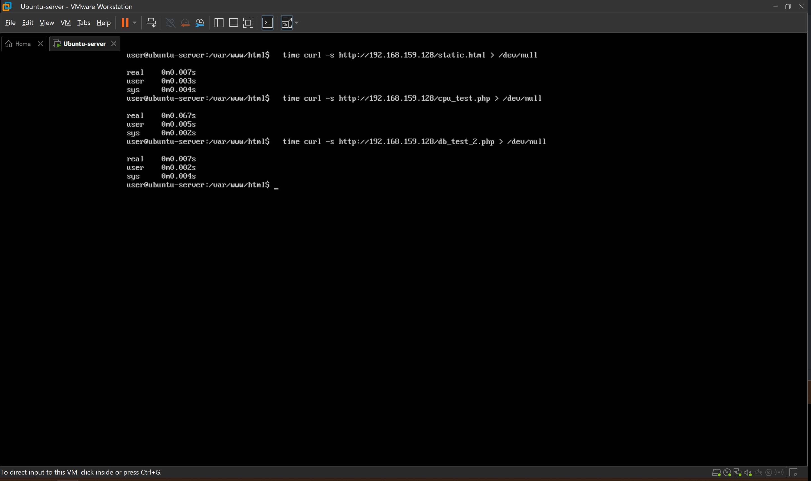
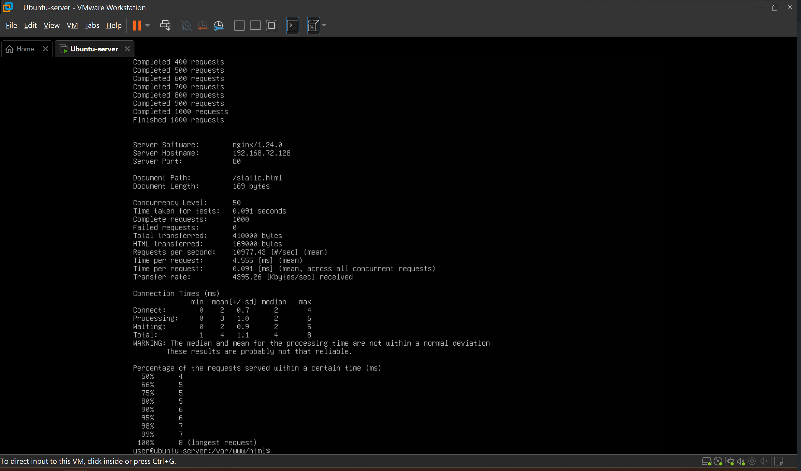
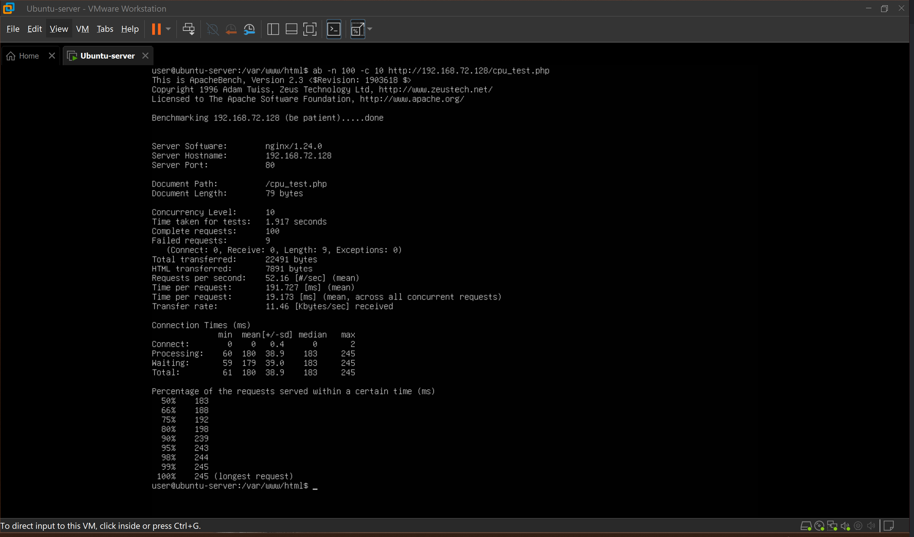
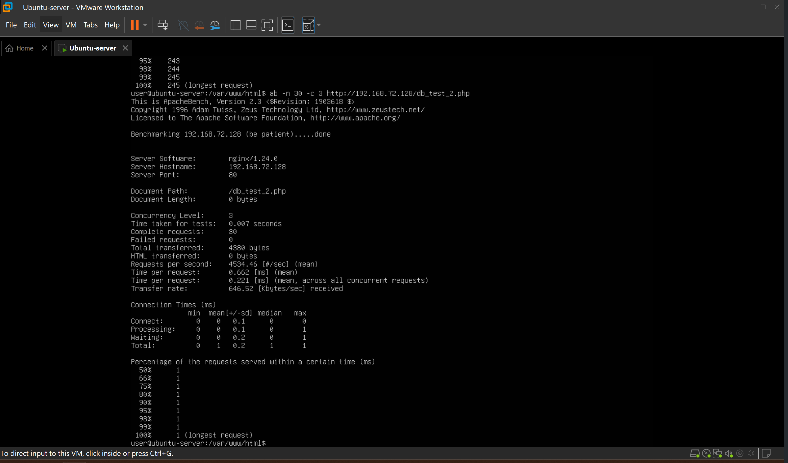
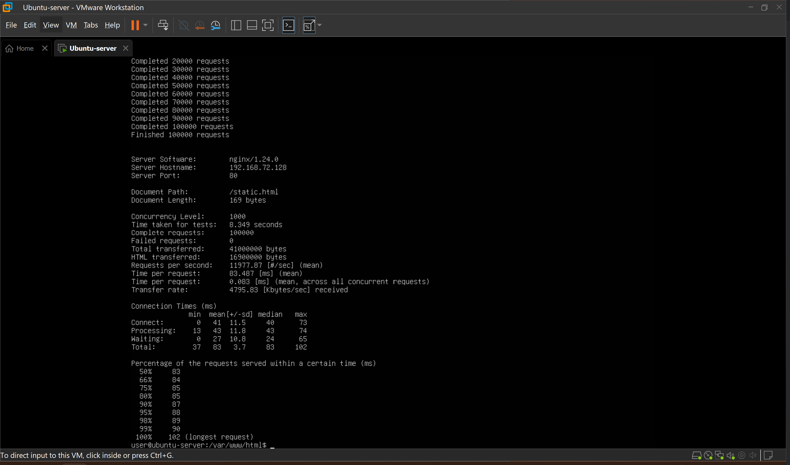
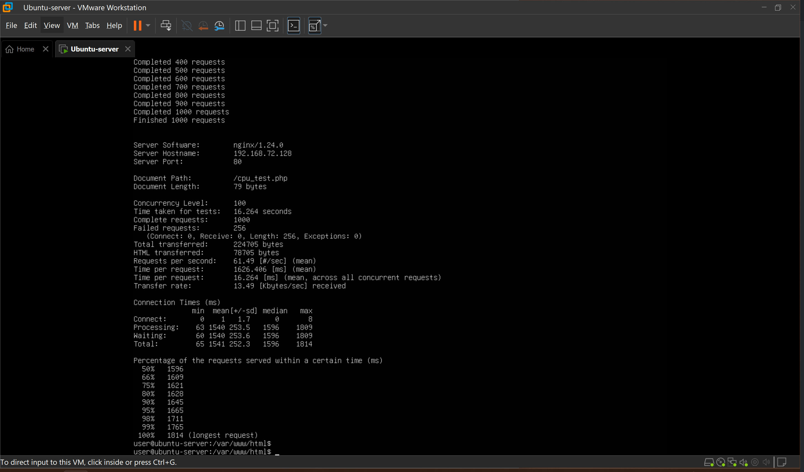
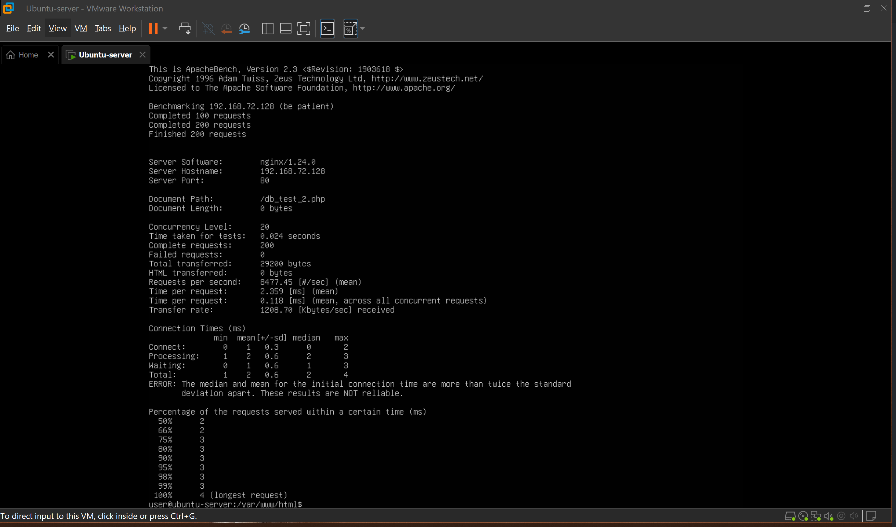

## 성능 테스트, 병목분석
(아래 내용의 코드블럭 안은 Linux 명령어 or PowerShell 명령어 입니다.)<br>
### 학습 목표: 서버에 부하가 걸리고 느려지는 경우 병목 포인트를 찾아내는 상황을 시뮬레이션 합니다. 

<br>

### 1. 테스트 준비 - 테스트 용 페이지 제작, 테스트 툴 설치

1) 정적 페이지(static page) 준비
- Nginx만 사용하는 간단한 정적 페이지를 준비합니다.
    ```bash
    sudo vi /var/www/html/static.html
    ```
    ```html
    # html 안은 아래와 같이 작성 해줍니다.
    <!DOCTYPE html>
    <html>
    <head>
    <title>Static Test</title>
    </head>
    <body>
    <h1>Static Page</h1>
    <p>This page is Nginx static file performance test page.</p>
    </body>
    </html>
    ```
<br>

2) PHP + CPU 부하 페이지 준비
- PHP-FPM 병목 현상을 시뮬레이션 하기 위해 복잡한 비지니스 로직, 대량 연산이 필요한 PHP 요청을 단순화해 작성하였습니다.
    ```bash
    sudo vi /var/www/html/cpu_test.php
    ```
    ```php
    <?php
    // CPU를 일부러 많이 쓰는 코드 (비효율적인 루프)
    $start = microtime(true);

    $sum = 0;
    for ($i = 0; $i < 5000000; $i++) {
        $sum += sqrt($i);
    }

    $end = microtime(true);
    $elapsed = $end - $start;

    echo "CPU Test Done<br>";
    echo "Elapsed: " . $elapsed . " seconds<br>";
    echo "Sum: " . $sum . "<br>";
    ?>
    ```

3) PHP + DB 부하 페이지 준비
- 외부 DB 응답 지연으로 인한 병목 상황을 시뮬레이션 하기 위해 SELECT SLEEP을 사용했습니다. 
    ```bash
    sudo vi /var/www/html/db_test.php
    ```
    ```php
    <?php
    $start = microtime(true);

    $mysqli = new mysqli("127.0.0.1", "testuser", "testpass", "testdb"); // 테스트를 하려는 DB의 user, 비번, DB 입니다.
    if ($mysqli->connect_errno) {
        echo "DB connection fail: " . $mysqli->connect_error;
        exit;
    }

    // 일부러 DB에 지연을 거는 쿼리 (SELECT SLEEP): 쿼리 하나당 0.2초씩 지연 됩니다.
    for ($i = 0; $i < 20; $i++) {
        $mysqli->query("SELECT SLEEP(0.2)");
    }

    $mysqli->close();

    $end = microtime(true);
    $elapsed = $end - $start;

    echo "DB Test Done<br>";
    echo "Elapsed: " . $elapsed . " seconds<br>";
    ?>
    ```

4) 과부하 테스트 툴 설치
- 웹 서버 부하 테스트 툴인 Apache Bench를 설치 합니다.<br>
  Apache Bench는 웹 서버에 몇 명의 사용자가 동시에 접속해서 요청을 보내도 서버가 버틸 수 있는지 테스트 하는 도구입니다.
  ```bash
  sudo apt update
  sudo apt install apache2-utils -y
  ```
<br><br>

### 2. 병목 테스트

#### 1. 정상 상태 기준 설정 하기
- 정상과 비정상 여부를 확인 하기 위해서는 먼저 정상일 때의 시간을 측정해서 "정상 상태"의 기준을 파악해야 합니다.<br>
  서버 자체의 병목만을 테스트 해야, 병목 발생 시 서버 문제인지 네트워크 문제인지 알수 있기 때문에<br>
  time curl과 ab는 MS PowerShell 같은 클라이언트 측에서 실행하지 않고 서버에서 실행 해야 됩니다.

  1. time 명령어를 활용한 기본 시간 측정
   - time 명령어는 프로그램이나 스크립트의 실행시간을 확인 하는 명령어 입니다.<br>
    우리는 위에서 단순한 정적 페이지, PHP에서 SQRT 500만 번을 돌리는 CPU Heavy Load 페이지,
    DB에 SLEEP을 거는, 지연이 큰 DB 요청 하나를 인위적으로 만들어내는 테스트용 페이지를 작성했습니다.<br>
    테스트 페이지는 "대략 평소에 이러한 요청은 얼마나 걸린다" 하는 가정하에 작성 한것이기에
    실제 서버에서는 그 서버의 용도에 따라 평소에 들어오는 실제 트래픽의 대표 URL을 골라서 정상 기준을 잡아야 합니다.
        ```bash
        # /dev/null : HTML 코드는 보여주지 않고 시간 결과만 보여줍니다.
        time curl -s http://192.168.159.128/static.html > /dev/null
        time curl -s http://192.168.159.128/cpu_test.php > /dev/null
        time curl -s http://192.168.159.128/db_test.php > /dev/null
        ```
        <br>
        : time 명령어의 항목 의미는 다음과 같습니다.
        - real: 사람 기준으로 실제 흐른 시간, 시작버튼 누르고 끝날 때까지 걸린 전체 시간
        - user: CPU가 user space에서 쓴 시간, 커널 밖에서 실행되는 시간
        - sys: CPU가 커널 내부에서 사용한 시간, syscall, 메모리 할당 등
  
  2. ab를 이용한 기본 상태 측정
   - 각각 평상 시 상황을 가정하여 평상시의 부하를 측정 합니다.<br>
    : 현재는 테스트 서버이기 때문에 Static -n 1000 -c 50 / CPU -n 100 -c 10 / DB -n 30 -c 3 로 가정하여 진행하겠습니다.(첫번째 이미지 부터 Stactic, CPU, DB 이며 -n은 요청 횟수, -c는 동시 접속자 입니다.)
    <br>
    <br>
    <br>

#### 2. Apache Bench를 이용한 과부하 테스트
   - ab를 이용한 병목을 인위적으로 유발 합니다.<br>
    : 첫번째 이미지 부터 Static -n 100000 -c 1000 / CPU -n 1000 -c 100 / DB -n 200 -c 20 입니다.
    <br>
    <br>
    <br>
<br>
### 3. Apache Bench 병목 테스트의 의미

1) 정적 페이지(Static page)
- ab 정적 페이지 테스트는 서버 내부에서 실행해 동일 서버 내에서 HTTP 클라이언트(ab)가 웹 서버(Nginx)로 요청을 전송하는 loopback 기반 테스트입니다. 네트워크 지연을 배제하고 서버 처리 성능과 병목 지점을 집중적으로 분석하기 위한 목적의 테스트입니다.
- 과부하 이전과 이후에 대해 비교 해보겠습니다.
  1. Reqests per second: 10977/sec(평상 시), 11977/sec(병목 시)<br>
    : 평상 시의 초당 처리 요청수와 병목 시의 초당 처리 요청수가 큰 차이가 없습니다. 이는 이미 서버가 평소에도 처리 가능한 최대 처리량 상태임을 추정할 수 있습니다.
  2. Time per request: 4.555ms(평상 시), 83.487ms(병목 시)<br>
    : RPS는 큰 차이가 없었는데 TPR만 늘어났습니다. 이는 즉, 요청이 대기열에 쌓이기 시작했다는 증거입니다.
  3. Waiting: 2ms(평상 시), 27ms(병목 시)<br>
    : 요청은 서버에 도착했는데 nginx worker가 처리 못하고 대기한 시간이 늘어났습니다. nginx worker의 가용성이 한계에 도달 했다는걸 추정할수 있습니다.
  4. Connect: 2ms(평상 시), 41ms(병목 시)<br>
    : 서버 외부에서의 테스트면 네트워크 문제일 수 있으나 내부에서의 테스트 이기 때문에 커널 + nginx accept 단계에서 병목이 일어남을 알 수 있습니다.
  5. Percentile(지연분포): 5~7ms(평상 시), 약 80ms(병목 시)<br>
    : Percentile은 "몇 %의 요청이 몇 ms 안에 끝났는가" 를 보여주는 지표 입니다. 특정 구간만 지연된게 아니라 전체적으로 지연이 일어나고 있어, 단순한 서버 포화 상태의 특징일 보여줍니다.

  6. 결론: 동일한 정적 페이지에 대해 동시 접속 수를 50에서 1000으로 증가시킨 결과, 서버의 최대 처리량은 약 12k requests/sec 수준에서 포화되었으며, 이후에는 처리량 증가 없이 응답 지연(latency)만 증가하는 전형적인 saturation 패턴이 관찰되었습니다. 특히 Waiting 및 Connect 시간이 크게 증가하여 서버 리소스 및 요청 처리 큐에서 병목이 발생했음을 확인할 수 있었습니다.

